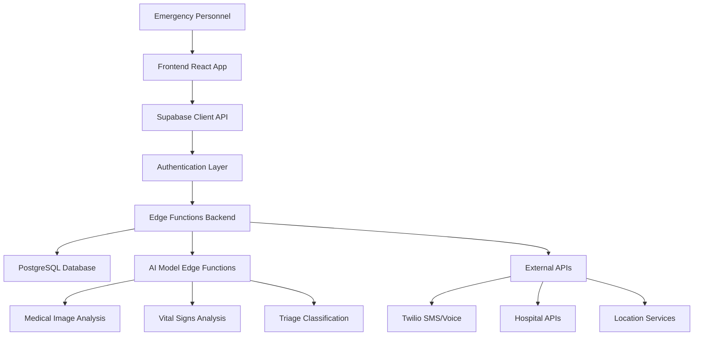

# Trauma Linker - System Architecture

## 📁 Project Structure

This project is organized into logical layers that separate frontend, backend services, database schema, and AI models. Due to the current limitations of the development environment, all code is currently in the `src/` folder, but the architecture is designed for a proper 4-tier separation:

```
trauma-linker/
├── src/                          # Frontend React Application
│   ├── components/              # React Components
│   │   ├── ui/                  # Reusable UI components (shadcn/ui)
│   │   ├── patient/            # Patient-specific components
│   │   └── profile/            # User profile components
│   ├── pages/                  # Application pages/routes
│   ├── hooks/                  # Custom React hooks & API integrations
│   ├── lib/                    # Utilities and helper functions
│   ├── types/                  # TypeScript type definitions
│   └── styles/                 # CSS and styling files
│
├── backend/                     # Backend Services (Supabase Integration)
│   ├── api/                    # API endpoints and services
│   ├── services/               # Business logic services
│   │   ├── ai/                 # AI model integration services
│   │   └── communication/      # SMS, voice, notification services
│   └── middleware/             # Authentication and middleware
│
├── database/                   # Database Schema (Supabase PostgreSQL)
│   ├── schema/                 # SQL schema definitions
│   ├── migrations/             # Database migrations
│   └── seed/                   # Seed data for development
│
└── ai-models/                  # AI/ML Models (Edge Functions)
    ├── medical-analysis/       # Medical image analysis models
    ├── vital-analysis/         # Vital signs analysis models
    └── triage-classification/  # Automated triage classification
```

## 🏗️ Architecture Layers

### 1. Frontend Layer (React SPA)
**Current Location: `src/`**

- **Purpose**: User interface for emergency medical personnel
- **Technology**: React 18 + TypeScript + Tailwind CSS + shadcn/ui
- **Key Features**:
  - Real-time patient assessment forms
  - AI-powered medical image analysis interface
  - Hospital communication dashboard
  - Live location tracking and routing
  - Responsive design for mobile/tablet use in field conditions

### 2. Backend Services Layer (Supabase Integration Required)
**Planned Location: `backend/`**

- **Purpose**: API services, business logic, and third-party integrations
- **Technology**: Supabase Edge Functions (TypeScript/Python)
- **Implementation Requirements**:
  ```
  🔗 Requires Supabase Integration - Click green Supabase button to connect
  ```
- **Key Services**:
  - Hospital API integration (OpenStreetMap, Google Places)
  - Communication services (Twilio SMS/Voice)
  - Real-time location services
  - Authentication and authorization
  - File storage for medical images

### 3. Database Layer (Supabase PostgreSQL)
**Planned Location: `database/`**

- **Purpose**: Secure storage of patient data, hospital information, and case records
- **Technology**: PostgreSQL with Row Level Security (RLS)
- **Implementation Requirements**:
  ```
  🔗 Requires Supabase Integration - Click green Supabase button to connect
  ```
- **Key Tables**:
  - `patients` - Patient demographic and medical data
  - `hospitals` - Hospital capabilities and real-time status
  - `emergency_cases` - Active case tracking and outcomes
  - `medical_assessments` - AI analysis results and vital signs
  - `communication_logs` - Audit trail for all notifications

### 4. AI Models Layer (Supabase Edge Functions)
**Planned Location: `ai-models/`**

- **Purpose**: Machine learning models for medical analysis and decision support
- **Technology**: TensorFlow/PyTorch deployed as Edge Functions
- **Implementation Requirements**:
  ```
  🔗 Requires Supabase Integration - Click green Supabase button to connect
  ```
- **Key Models**:
  - **Trauma Image Classifier**: CNN for injury detection and severity assessment
  - **Vital Signs Analyzer**: Pattern recognition for emergency condition detection
  - **Triage Classifier**: Multi-modal assessment for priority determination
  - **Risk Predictor**: Outcome prediction based on patient data

## 🔄 Data Flow Architecture



## 🔧 Integration Requirements

### Supabase Native Integration Setup

To enable the full system architecture, you need to activate the Supabase integration:

1. **Click the green Supabase button** in the top right of the Lovable interface
2. **Connect to Supabase** to enable backend functionality
3. **Configure the following in your Supabase project**:

#### Database Setup
```sql
-- Enable required extensions
CREATE EXTENSION IF NOT EXISTS "uuid-ossp";
CREATE EXTENSION IF NOT EXISTS "postgis"; -- For location-based queries

-- Create tables using schemas from database/schema/
-- Set up Row Level Security policies
-- Configure real-time subscriptions
```

#### Edge Functions Setup
```bash
# Deploy AI model functions
supabase functions deploy medical-image-analysis
supabase functions deploy vital-signs-analyzer
supabase functions deploy hospital-communication
supabase functions deploy location-services
```

#### Environment Variables
```env
# Configure in Supabase Dashboard -> Settings -> API
TWILIO_ACCOUNT_SID=your_twilio_account_sid
TWILIO_AUTH_TOKEN=your_twilio_auth_token
TWILIO_PHONE_NUMBER=your_twilio_phone_number
GOOGLE_MAPS_API_KEY=your_google_maps_api_key
OPENAI_API_KEY=your_openai_api_key
HOSPITAL_API_KEYS=your_hospital_integration_keys
```

## 🔒 Security Architecture

### Data Protection
- **HIPAA Compliance**: All patient data encrypted at rest and in transit
- **Row Level Security**: Database-level access controls
- **API Authentication**: JWT-based authentication with role-based permissions
- **Audit Logging**: Complete trail of all data access and modifications

### Access Control Matrix
| Role | Patient Data | Hospital Data | AI Models | Communications |
|------|--------------|---------------|-----------|----------------|
| EMT | Read/Write | Read | Use | Send |
| Dispatcher | Read | Read/Write | Use | Send |
| Hospital Staff | Read (assigned) | Read/Write (own) | Use | Receive |
| Administrator | Read All | Read/Write All | Configure | Monitor |

## 📊 Performance Architecture

### Real-time Requirements
- **Patient Assessment**: < 2 seconds for form submission
- **AI Analysis**: < 5 seconds for image classification
- **Hospital Notification**: < 3 seconds for SMS/call dispatch
- **Location Updates**: < 1 second for GPS tracking

### Scalability Design
- **Horizontal Scaling**: Supabase Edge Functions auto-scale
- **Database Optimization**: Indexed queries, connection pooling
- **CDN Integration**: Static assets via Supabase Storage
- **Caching Strategy**: Real-time data with intelligent cache invalidation

## 🚀 Deployment Architecture

### Development Environment
```bash
# Local development with hot reloading
npm run dev

# Uses Supabase local development stack
supabase start
```

### Production Environment
```bash
# Automated deployment via Lovable
# Supabase handles:
# - Database hosting and backups
# - Edge Function deployment
# - CDN and global distribution
# - SSL certificates and security
```

## 📈 Monitoring & Observability

### Application Monitoring
- **Real-time Metrics**: Response times, error rates, user sessions
- **Medical Metrics**: Case completion rates, AI accuracy, response times
- **Infrastructure Metrics**: Database performance, function execution times

### Alerting Strategy
- **Critical Alerts**: System downtime, data corruption, security breaches
- **Medical Alerts**: Failed emergency notifications, AI confidence drops
- **Performance Alerts**: Response time degradation, capacity limits

## 🔄 Future Architecture Enhancements

### Planned Integrations
- **IoT Device Integration**: Direct connection to medical monitoring equipment
- **Hospital EMR Systems**: Seamless patient record integration
- **Emergency Service APIs**: Automated dispatch system integration
- **Wearable Device Support**: Real-time vital signs from patient devices

### Scalability Roadmap
- **Multi-region Deployment**: Global availability for international use
- **Edge Computing**: Local processing for critical response times
- **Offline Capability**: Field operation without internet connectivity
- **Advanced AI**: Continuous learning from anonymized case data